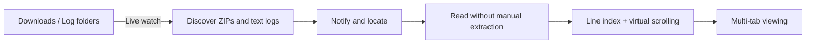

<p align="center">
  <strong>English</strong> · <a href="./README_ZH.md">简体中文</a>
</p>

<p align="center">
  
</p>

<h1 align="center">LogPeek</h1>

<p align="center">
  <strong>Watch folders. Catch new logs. Skip extraction. Start reading.</strong>
</p>

<p align="center">
  A lightweight desktop log viewer for Windows and macOS.<br>
  Turn “download archive → extract → hunt for logs → open files” into one click.
</p>

<p align="center">
  <a href="https://github.com/Strive-Sun/LogPeek/releases/latest"></a>
  <a href="https://github.com/Strive-Sun/LogPeek/actions/workflows/ci.yml"></a>
  
  
</p>

<p align="center">
  <a href="https://github.com/Strive-Sun/LogPeek/releases/latest"><strong>Download the latest release</strong></a>
  · <a href="CHANGELOG.md">Changelog</a>
  · <a href="docs/technical-design.md">Technical design</a>
</p>

---

## Why LogPeek

Production debugging often starts with a ZIP file: download it, extract it, dig through nested folders for `.log` or `.txt` files, then open them one by one. The larger the files and the more archives you receive, the more this repetitive workflow interrupts the investigation.

LogPeek is built around that exact path:



- **Discover logs as they arrive** — recursively watch directories and notify even when new logs land deep inside unopened subfolders.
- **Read ZIPs directly** — browse archive entries like a folder without creating a scattered manual extraction directory.
- **Open large logs** — build line indexes in the background and load only the visible range instead of putting a multi-gigabyte file into memory.
- **Keep investigation context** — each tab retains its own scroll position, encoding, and loaded content.
- **Local-first processing** — logs stay on your machine; no cloud upload service is required.

## Highlights

| Capability | What it does |
|---|---|
| Live directory monitoring | Reflects external create, delete, rename, and modify operations; discovers new logs at any directory depth |
| ZIP without manual extraction | Browses the archive directory and opens internal log entries directly |
| Plain log viewing | Reads `.log`, `.txt`, `.out`, `.err`, `.trace`, `.json`, `.csv`, and other recognized text files |
| Drag and start | Dropping one file watches its parent; dropping a folder watches that folder; dropping a text log also opens and locates it |
| Multi-file tabs | Deduplicates repeated opens, moves overflow into a More menu, and preserves per-file reading state |
| Virtual scrolling for large logs | Uses line-offset indexing, windowed reads, and bounded caches so memory usage does not scale with the full file |
| Encoding support | Detects UTF-8, GBK / GB18030, UTF-16LE / UTF-16BE, with manual override |
| New-log notifications | Shows an unread badge, locates individual arrivals, and supports marking everything as read |
| Suffix filtering | Controls which file extensions appear and trigger notifications, with an option to show everything |
| Automatic updates | Supports startup or manual checks, download progress, signature verification, installation, and relaunch |
| Desktop behavior | Includes light/dark themes, close-to-tray, auto-hiding scrollbars, and a resizable directory pane |

> LogPeek is currently a **read-only viewer**. It can rename or delete files on disk, but it cannot edit and save log content or rewrite entries inside a ZIP.

## Get started in 5 minutes

### 1. Install

Open [GitHub Releases](https://github.com/Strive-Sun/LogPeek/releases/latest) and download the installer for your system:

- **Windows** — prefer `setup.exe`; an `.msi` package is also available.
- **macOS** — download the `.dmg`; releases are built as universal binaries.

LogPeek uses the system WebView. Windows 10 and 11 usually include WebView2 already; if it is missing, Windows will prompt you to install it.

### 2. Add a watched folder

On first launch, click **“+ Add watched folder”** at the bottom of the left sidebar. Good candidates include:

- your browser Downloads folder;
- a chat application's received-files folder;
- a test-device export directory;
- a local service log directory.

LogPeek persists watched folders and restores them on the next launch. Watch roots are normalized by parent-child coverage, so a child is not watched twice after its parent has been added.

### 3. Open a log

Start reading in any of these ways:

1. Click a plain log file in the directory tree.
2. Expand a ZIP and click one of its log entries.
3. Drag a log, ZIP, or folder from the file manager into LogPeek.

When you drop a text log, LogPeek adds its parent folder, expands the tree, locates the file, and opens it. Dropping a ZIP or another file adds its containing folder to monitoring. Dropping a folder watches that folder itself.

> One dropped path is handled at a time today. Multi-file drag and drop is on the roadmap.

### 4. View multiple files

Click more logs to create tabs:

- opening the same file again activates its existing tab instead of creating a duplicate;
- tabs that no longer fit move into the **More** menu;
- choosing a file from More swaps it into the visible tab strip;
- hovering a tab name shows the full absolute path;
- clicking `×` releases that tab's viewing session.

The backend keeps a bounded number of active sessions. An older tab may become dormant; clicking it transparently rebuilds its index and restores the selected encoding.

### 5. Fix encoding and filter files

- **Garbled text** — use the encoding selector at the bottom-left of the content pane to choose UTF-8, GBK, GB18030, or UTF-16.
- **Too many files** — use the suffix filter beside “Watched folders” to keep only the extensions you care about.
- **Need another file temporarily** — enable “Show all”; a currently open file remains visible even if it no longer matches the filter.

### 6. Handle newly arrived logs

When a new ZIP or matching log appears under a watched folder, the bell in the top-right shows an unread count. Clicking a notification expands the directory chain and locates the target. “Mark all as read” clears notifications only; it never deletes files.

## Common tasks

| I want to… | Action | Result |
|---|---|---|
| Watch another folder | Click “+ Add watched folder” | Saves the folder and starts recursive monitoring immediately |
| Inspect a local log quickly | Drop one log into the window | Adds its parent, locates the file, and opens it |
| Watch a whole folder | Drop the folder into the window | Adds that folder as a watch root |
| Read a log inside a ZIP | Expand the ZIP and click an entry | Creates a viewing session without manual extraction |
| Distinguish same-named files | Hover a tab | Shows the absolute disk path and archive entry path |
| Change text encoding | Use the encoding menu below the content | Rebuilds the line index in the background |
| Locate a path in the file manager | Right-click a file or folder | Opens the system file manager at that path |
| Stop watching but keep files | Right-click a watch root → Remove watch | Removes monitoring without changing disk content |
| Delete a file or directory | Right-click → Delete, then confirm | Moves it to the system recycle bin instead of permanently deleting it |
| Keep LogPeek running in the background | Click the window close button | Hides to the tray while monitoring continues |
| Exit completely | Tray menu → Exit LogPeek | Stops monitoring and terminates the process |
| Check for a new release | Settings → Check for updates | Downloads, verifies, and installs an official release |

## Support matrix

### Supported today

- **Operating systems** — 64-bit Windows; Intel and Apple Silicon macOS.
- **Archives** — ZIP.
- **Text** — common log extensions plus files recognized as text through content sampling.
- **Encodings** — UTF-8, GBK, GB18030, UTF-16LE, and UTF-16BE.

### Current boundaries

- Read-only preview; no editing or saving of log content.
- One path per drag-and-drop operation.
- No direct modification of ZIP entries.
- Automatic updates require access to GitHub Release download endpoints.
- tar.gz, 7z, and rar are not implemented yet; see the roadmap below.

## Roadmap

The roadmap describes direction, not a promised version or delivery date. Issues are welcome when discussing priorities.

### Near term: find important lines faster

- [ ] **Log-level filters** — recognize and filter `INFO`, `WARNING / WARN`, `ERROR`, and `FATAL` entries.
- [ ] **Log-level annotations** — apply consistent colors, line markers, and counts so failures and their context stand out.
- [ ] **Full-text search and highlighting** — keywords, case sensitivity, regular expressions, result counts, and next/previous navigation.
- [ ] **Fast time navigation** — jump by timestamp and restrict the view to a time range.
- [ ] **Multi-file drag and drop** — accept several logs or folders at once and report the result of each item.

### Mid term: side-by-side investigation

- [ ] **Side-by-side log panes** — display two logs next to each other with independent or synchronized scrolling.
- [ ] **Log comparison** — align by line, time, or key fields and highlight additions, omissions, and changes.
- [ ] **Workspace restoration** — restore open files, the active tab, and reading positions after a restart.
- [ ] **Bookmarks and line annotations** — save important lines and local notes, then recover their location when possible after a file changes.
- [ ] **Follow appended content** — provide a `tail -f`-style follow mode for plain logs that are still being written.

### Long term: more formats and stronger workflows

- [ ] **More archive formats** — tar.gz and 7z, plus rar where licensing and cross-platform constraints allow it.
- [ ] **Structured log views** — expand fields, select columns, and apply conditions to formats such as JSON Lines.
- [ ] **Search indexes for huge logs** — accelerate repeated queries without loading the complete file into memory.
- [ ] **Export investigation snippets** — export the smallest useful range by selected lines or time window for issues and team sharing.
- [ ] **Reusable rule sets** — save combinations of levels, keywords, colors, and suffixes, then switch between projects quickly.

## How it works

LogPeek is built with Tauri 2. The frontend owns interaction and virtualized lists; the Rust backend owns file watching, ZIP access, encoding detection, and line indexing.

| Layer | Responsibility |
|---|---|
| React + TypeScript | Directory tree, notifications, tabs, settings, and the virtualized log view |
| Tauri IPC | Commands and progress events between the UI and local Rust capabilities |
| Rust watcher | Recursive directory monitoring, event coalescing, file stability checks, and configuration persistence |
| ArchiveReader | ZIP central-directory access and a shared abstraction for archive entries and plain text |
| SessionManager | Encoding detection, line-offset indexes, bounded-session LRU, and temporary-resource cleanup |

Read the [technical design](docs/technical-design.md) for implementation detail and [CHANGELOG.md](CHANGELOG.md) for version history.

## Local development

### Prerequisites

- [Node.js](https://nodejs.org/) 22 or the current LTS release;
- [Rust](https://rustup.rs/) and Cargo;
- on Windows, the Visual Studio “Desktop development with C++” workload;
- the platform dependencies listed in [Tauri Prerequisites](https://v2.tauri.app/start/prerequisites/).

### Run the desktop app

```bash
npm install
npm run tauri:dev
```

The first run compiles the Tauri and Rust dependency tree. Later runs use incremental compilation.

### Work on the frontend only

```bash
npm run dev
```

Open `http://localhost:1420`. In a browser, the frontend automatically uses built-in mock data, so the Rust backend is not required.

### Quality checks

```bash
npm run format:check
npm test
npm run lint
npm run build
cargo test --manifest-path src-tauri/Cargo.toml
```

### Build installers

```bash
npm run tauri:build
```

Artifacts are written to `src-tauri/target/release/bundle/`. Official releases are built and signed by GitHub Actions on Windows and macOS.

## Repository layout

```text
logpeek/
├── src/                  # React + TypeScript frontend
│   ├── api/              # Tauri / mock API adapters
│   ├── components/       # Directory tree, tabs, log view, settings, and dialogs
│   └── util/             # Pure state helpers and frontend unit tests
├── src-tauri/            # Rust + Tauri backend
│   └── src/
│       ├── archive/      # ZIP and plain-text reader abstraction
│       ├── index.rs      # Line indexes, encodings, caches, and session lifecycle
│       ├── watcher.rs    # Directory monitoring, stability checks, and persisted configuration
│       └── lib.rs        # Tauri commands, events, tray, and application lifecycle
├── openspec/             # Capability specs, change proposals, and archives
├── docs/                 # Technical design and development workflow
└── .github/workflows/    # CI and cross-platform releases
```

## Contributing

Issues, feature proposals, and pull requests are welcome. When reporting a problem, please include:

- the LogPeek version and operating system;
- whether the log is a plain file or an entry inside a ZIP;
- the file size, encoding, and reproduction steps;
- a screenshot for UI issues, after removing sensitive log content and local paths.

New capabilities are specified through OpenSpec before implementation. See [docs/dev-workflow.md](docs/dev-workflow.md) for the development and release workflow.

## License

This repository does not currently include an open-source license. Until a license is added, do not assume the code may be freely copied, modified, or redistributed.

